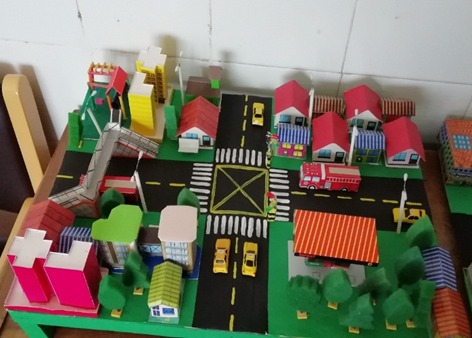

## **PRACTICA 1: ENCENDER Y APAGAR UN LED UTILIZANDO UN BOTÓN PULSADOR**
### **Objetivo:**
Encender y apagar un LED utilizando un botón pulsador que envié una señal que Arduino registre y decida si encienda o apague el LED. 

### **Descripción:**
1.	Colocar el LED en el Protoboard. 
2.	Conectar una resistencia de 220ohms o 330ohms al lado plano del LED. 
3.	En la parte del lado redondo del LED(Anodó+) se conecta un cable que ira a un pin digital de la tarjeta Arduino, en nuestro caso el pin 4. 
4.	Se coloca el botón en la Protoboard. 
5.	Al igual que con el LED se conecta una resistencia al botón, pero en este caso tiene que ser de 5k ohm o 10k ohm.
6.	En el otro extremo del botón se conecta un cable que conecte a una línea horizontal de la Protoboard, en nuestro caso la roja. hh
7.	Ahora se conectará un cable que vaya del pin 8 del Arduino a la Protoboard. 
8.	Lo siguiente es hacer la conexión de alimentación y tierra del Arduino, para eso vamos a la selección de alimentación de nuestro Arduino, sacamos un cable que vaya de 5v hasta la línea roja de nuestro Arduino, donde anteriormente se había conectado un cable que provenía del botón, eso es para la alimentación. 
9.	Por último, sacamos un cable de cualquiera de las dos tierras que trae Arduino para que vaya a la tierra (la línea azul donde conectamos la resistencia del LED).

###**Materiales:**

-	1 Tarjeta ARDUINO UNO 
-	1 Cable USB para ARDUINO 
-	1 Tarjeta protoboard 
-	1 Diodo LED común (cualquier color) </li>  
-	1 Pulsador 
-	Cables de conexión 
-	1 Resistencia de 220 ohms o 330 ohms 
-	1 Resistencia de 10k ohms 

###** Montaje:**

   
Montaje del circuito encender y apagar un Led con Arduino. 

### **Código para Arduino:**  

define LedR 4   
define Botón 8    
 Estado=0;    
 
**void setup** ()    {   
**pinMode** (LedR, OUTPUT);       
**pinMode** (Boton, INPUT);    
}  

**void loop**()  {   
  Estado= **digitalRead** (Botón);     
  **If** ((Botón==HIGH) {    
  **digitalWrite** (LedR, HIGH);    
  }   
else {   
   **digitalWrite** (LedR, LOW);    
  }    
}    

### **Maqueta:**

